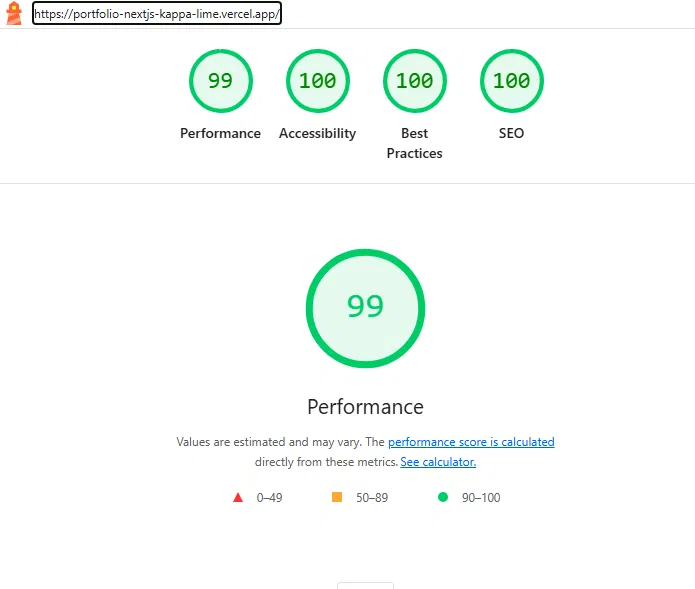
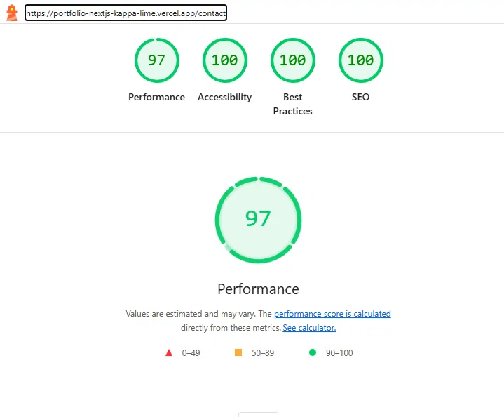
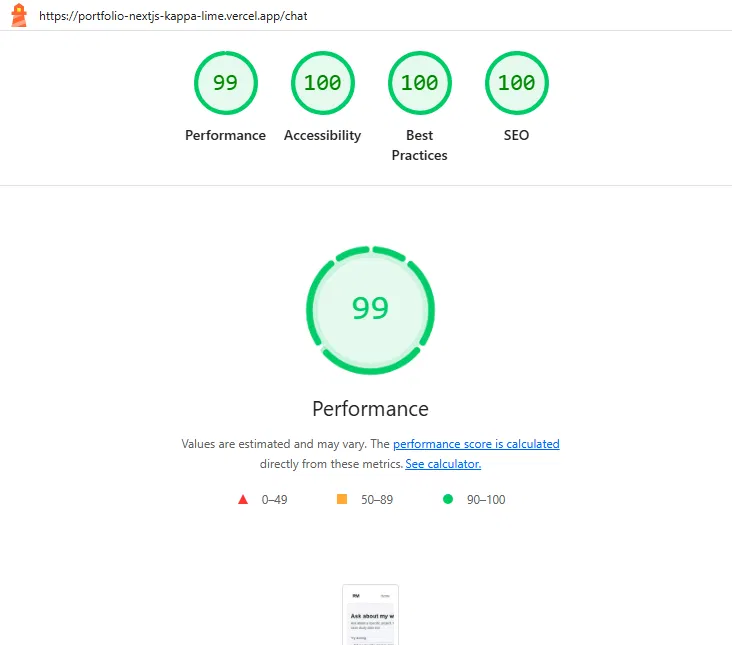
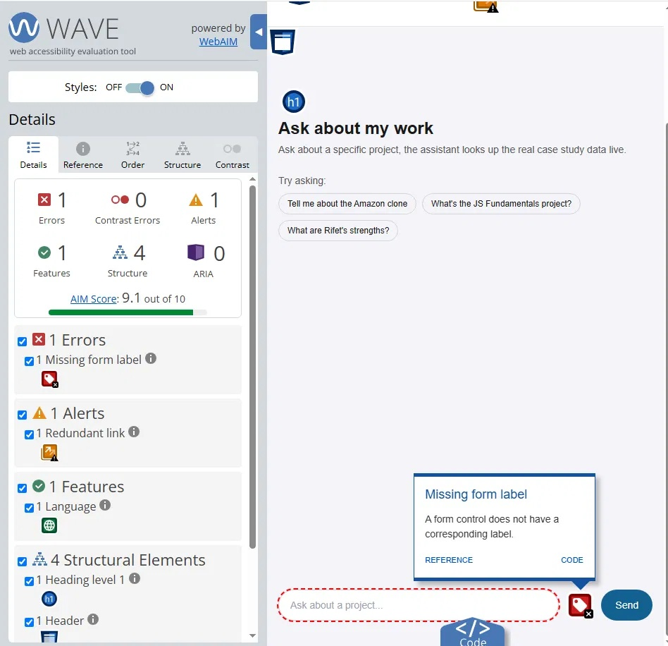
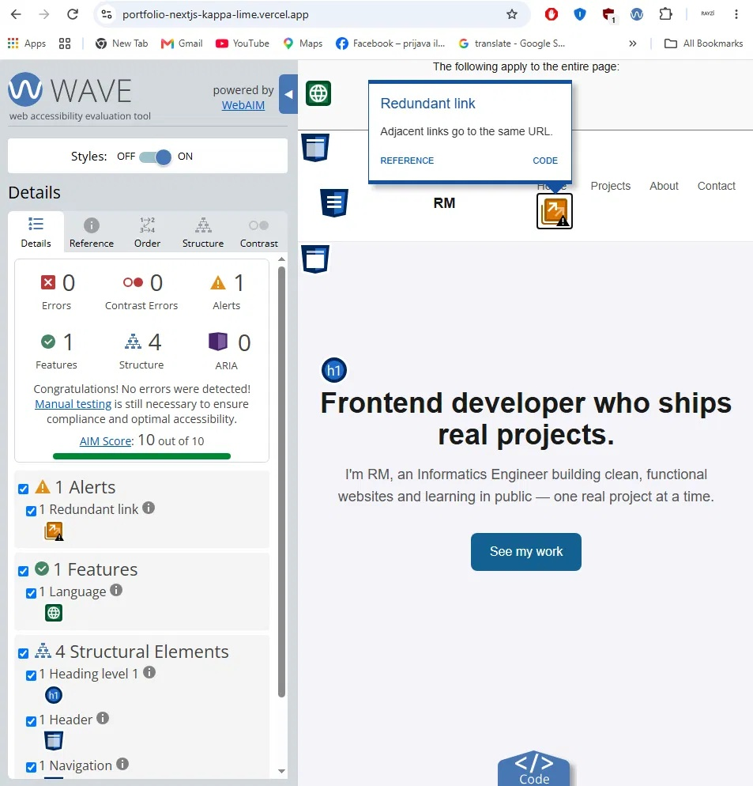
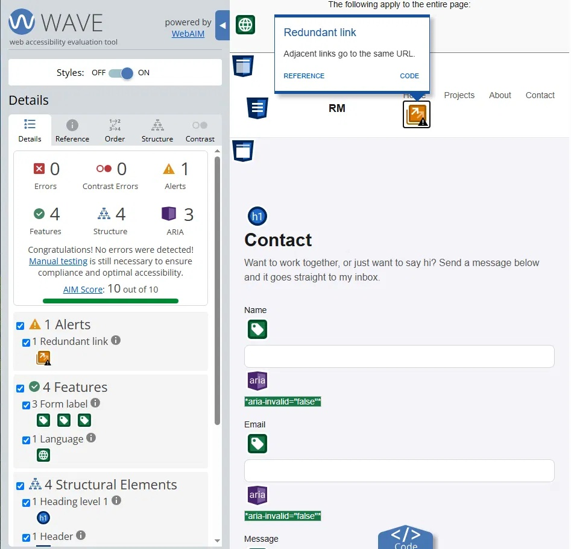
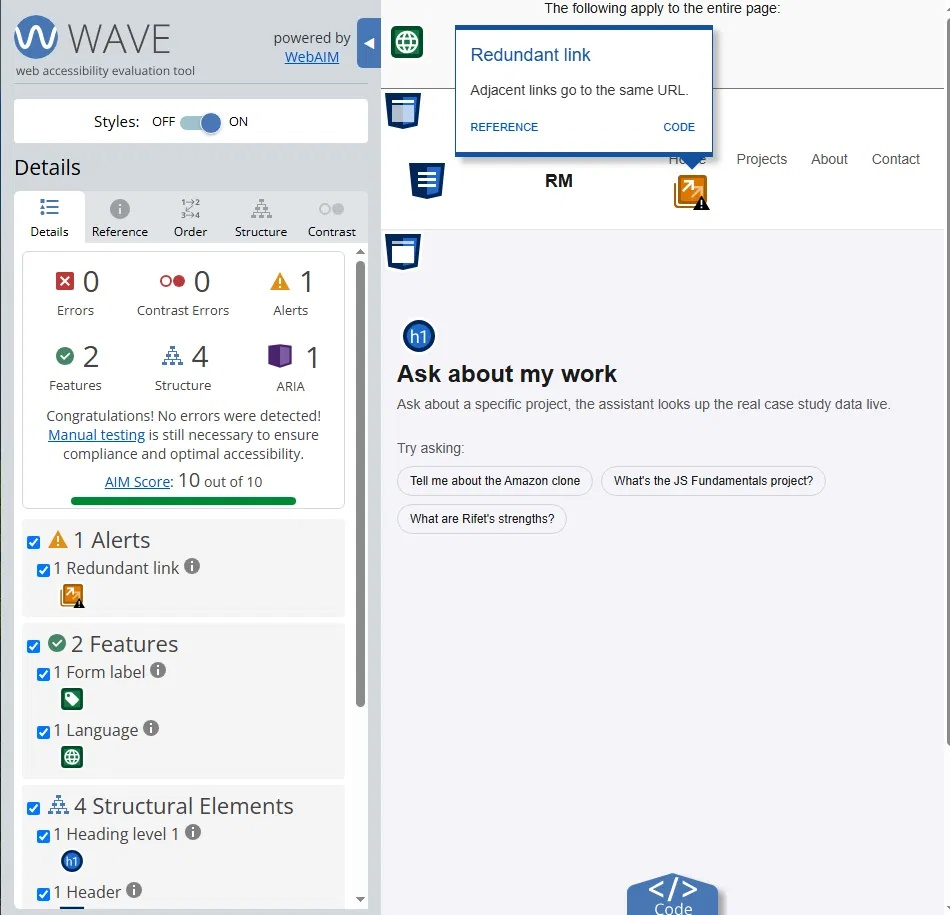

# Accessibility and Performance Audit (FE-10)

## Before scores

**Lighthouse (mobile), all pages:**
- Performance: 97-99
- Accessibility: 100
- Best Practices: 100
- SEO: 100

**WAVE, Chat page:**
- 1 Error: Missing form label
- AIM Score: 9.1 / 10

**WAVE, Home and Contact pages:**
- 0 Errors
- AIM Score: 10 / 10

## Changes

- Added a hidden label ("Message") tied to the chat input field, so
  screen readers announce what the field is for instead of nothing.
- Added an aria-live region that announces the assistant's full reply
  once it finishes streaming (not every word as it streams in, that
  would be too noisy to listen to).
- Confirmed the Stop button was already a real button, so it already
  worked fine with just a keyboard.
- Did a full keyboard-only pass through the chat flow (no mouse):
  clicked an example question, typed a message, sent it, stopped a
  reply mid-generation, and retried after an error. Everything worked
  and it was always clear what was focused.

## After scores

**Lighthouse (mobile), all pages:** same as before, already at 97-99
Performance and 100 on everything else.

**WAVE, Chat page:**
- 0 Errors
- AIM Score: 10 / 10

**WAVE, Home and Contact pages:** unchanged, 0 Errors, 10 / 10.

## One alert left on purpose

All three pages show one "Redundant link" alert: the logo ("RM") and
the "Home" link both go to the same page. Left this alone since the
two links have different text, so it doesn't confuse a screen reader
user, and fixing it would mean removing the logo's link, which would
make the site harder to use for everyone else.
